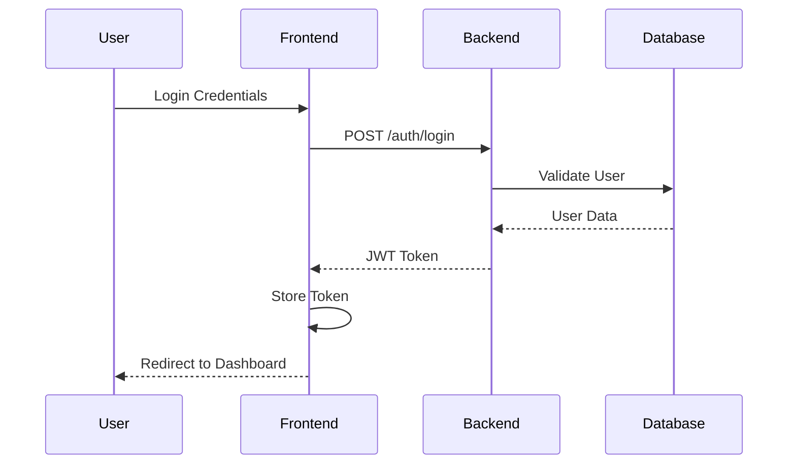
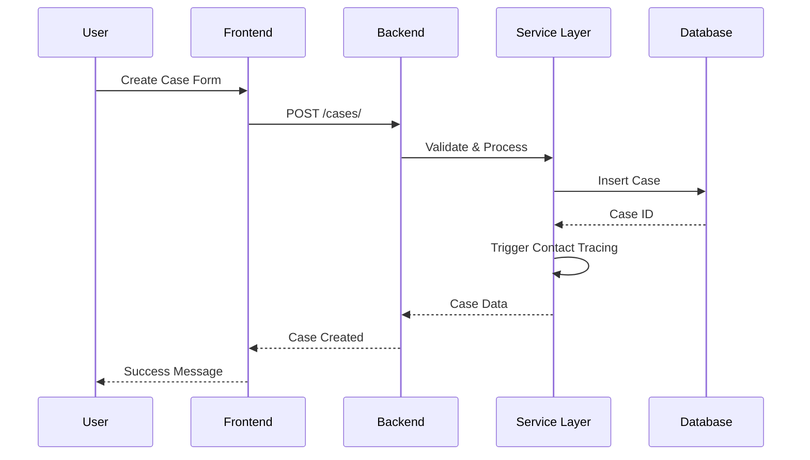
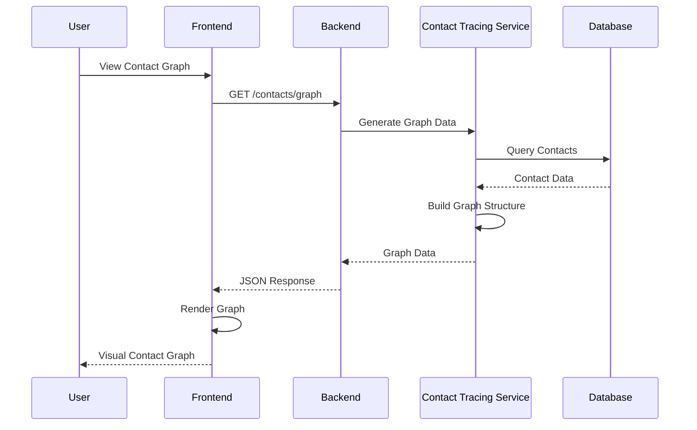

# Systemarchitektur

## Übersicht

Das Infection Management System folgt einer modernen Microservices-ähnlichen Architektur mit klarer Trennung zwischen Frontend, Backend und Datenbank. Das System ist für Skalierbarkeit, Wartbarkeit und Sicherheit optimiert.

## Architekturdiagramm

```
┌─────────────────┐    HTTP/WebSocket    ┌─────────────────┐
│   React Frontend │ ◄──────────────────► │  FastAPI Backend │
│                 │                      │                 │
│ - Dashboard     │                      │ - REST API      │
│ - Case Mgmt     │                      │ - Auth Service  │
│ - Contact Graph │                      │ - Business Logic│
│ - Statistics    │                      │ - Validation    │
└─────────────────┘                      └─────────────────┘
                                                   │
                                                   │ SQL
                                                   ▼
                                        ┌─────────────────┐
                                        │  PostgreSQL DB  │
                                        │                 │
                                        │ - Cases         │
                                        │ - Contacts      │
                                        │ - Users         │
                                        │ - Measures      │
                                        └─────────────────┘
```

## Komponenten

### 1. Frontend (React.js)

#### Technologie-Stack
- **React 18**: Moderne UI-Bibliothek
- **Context API**: State Management
- **CSS3**: Styling und Layout
- **Fetch API**: HTTP-Kommunikation

#### Architekturprinzipien
- **Komponenten-basiert**: Wiederverwendbare UI-Komponenten
- **Container/Presenter Pattern**: Trennung von Logik und Darstellung
- **Context-basiertes State Management**: Globale Zustandsverwaltung

#### Hauptkomponenten

```
src/
├── components/
│   ├── Auth/              # Authentifizierung
│   │   ├── Login.js       # Login-Formular
│   │   └── PrivateRoute.js # Geschützte Routen
│   ├── Dashboard/         # Dashboard-Komponenten
│   │   └── Dashboard.js   # Haupt-Dashboard
│   ├── CaseManagement/    # Fallverwaltung
│   │   └── CaseList.js    # Fall-Liste
│   └── ContactTracing/    # Kontaktverfolgung
│       └── ContactGraph.js # Kontakt-Graph
├── pages/                 # Seitenkomponenten
│   ├── DashboardPage.js   # Dashboard-Seite
│   ├── CasesPage.js       # Fälle-Seite (mit Fehlertoleranz)
│   ├── ContactsPage.js    # Kontakte-Seite
│   └── StatisticsPage.js  # Statistiken-Seite
├── services/              # API-Services
│   ├── api.js            # HTTP-Client
│   └── auth.service.js   # Auth-Service
└── context/               # React Context
    └── AuthContext.js     # Auth-Context
```

#### Fehlertoleranz-Features
Das Frontend implementiert umfassende Fehlertoleranz für Benutzereingaben:

**App-ID Validierung:**
- **Automatische Bereinigung**: Ungültige Zeichen werden entfernt
- **Zeichenzähler**: Echtzeit-Anzeige (X/35)
- **Visuelle Warnungen**: Gelbe Hervorhebung bei falscher Länge
- **Automatische Generierung**: Button zum Generieren gültiger IDs
- **Detaillierte Fehlermeldungen**: Spezifische Validierungshinweise

**Allgemeine Validierung:**
- **Name**: Mindestens 2 Zeichen, nur Buchstaben/Leerzeichen/Bindestriche
- **Alter**: 0-120 Jahre
- **Telefon**: Nur Ziffern, Leerzeichen, +, -, Klammern
- **E-Mail**: HTML5-Validierung mit zusätzlichem Feedback
- **Region**: Pflichtfeld mit Dropdown-Auswahl
- **Symptome**: Mindestens ein Symptom erforderlich

### 2. Backend (FastAPI)

#### Technologie-Stack
- **FastAPI**: Moderne Python Web-Framework
- **SQLAlchemy**: ORM für Datenbankzugriff
- **Pydantic**: Datenvalidierung und Serialisierung
- **Alembic**: Datenbankmigrationen
- **JWT**: Authentifizierung

#### Architekturprinzipien
- **Layered Architecture**: Klare Trennung der Schichten
- **Dependency Injection**: Lose Kopplung zwischen Komponenten
- **Repository Pattern**: Datenzugriffsabstraktion
- **Service Layer**: Business Logic Kapselung

#### Schichtenarchitektur

```
app/
├── api/                   # Präsentationsschicht
│   ├── deps.py           # Dependencies (Auth, DB)
│   └── endpoints/        # REST Endpoints
│       ├── auth.py       # Authentifizierung
│       ├── cases.py      # Fallverwaltung
│       ├── contacts.py   # Kontaktverfolgung
│       ├── measures.py   # Maßnahmen
│       └── users.py      # Benutzerverwaltung
├── core/                  # Konfigurationsschicht
│   ├── config.py         # App-Konfiguration
│   └── security.py       # Security-Utilities
├── crud/                  # Datenzugriffsschicht
│   ├── crud_case.py      # Fall-CRUD
│   ├── crud_contact.py   # Kontakt-CRUD
│   └── crud_user.py      # Benutzer-CRUD
├── models/                # Datenmodellschicht
│   ├── case.py           # Fall-Model
│   ├── contact.py        # Kontakt-Model
│   └── user.py           # Benutzer-Model
├── schemas/               # Validierungsschicht
│   ├── case.py           # Fall-Schemas
│   ├── contact.py        # Kontakt-Schemas
│   └── user.py           # Benutzer-Schemas
└── services/              # Business Logic Schicht
    ├── contact_tracing.py # Kontaktverfolgung
    └── notification_service.py # Benachrichtigungen
```

### 3. Datenbank (PostgreSQL)

#### Design-Prinzipien
- **Normalisierung**: Redundanzminimierung
- **Referentielle Integrität**: Konsistente Beziehungen
- **Indizierung**: Optimierte Abfragen
- **Audit-Trail**: Änderungsverfolgung

#### Haupttabellen

```sql
-- Benutzer
users (
  id, email, hashed_password, full_name, role, 
  is_active, created_at, updated_at
)

-- Regionen
regions (
  id, name, code, population, 
  created_at, updated_at
)

-- Personen
persons (
  id, first_name, last_name, date_of_birth, 
  email, phone, address, region_id,
  created_at, updated_at
)

-- Fälle
cases (
  id, name, age, status, date_reported, region,
  symptoms, user_app_id, contacts, phone, email,
  address, test_date, test_result, notes,
  contact_history, measures, created_at, updated_at
)

-- Kontakte
contacts (
  id, case_id, contact_person_id, contact_date,
  contact_type, duration_minutes, location,
  created_at, updated_at
)

-- Maßnahmen
measures (
  id, name, description, duration_days,
  category, target_group, created_at, updated_at
)
```

## Fehlertoleranz-Architektur

### Validierungsschichten

```
┌─────────────────┐
│   Frontend      │ ← Client-seitige Validierung
│   Validation    │   - Echtzeit-Feedback
│                 │   - Automatische Bereinigung
└─────────────────┘
         │
         ▼
┌─────────────────┐
│   API Gateway   │ ← Request-Validierung
│   Validation    │   - Pydantic-Schemas
│                 │   - Format-Prüfung
└─────────────────┘
         │
         ▼
┌─────────────────┐
│   Database      │ ← Datenbank-Constraints
│   Constraints   │   - CHECK Constraints
│                 │   - UNIQUE Constraints
└─────────────────┘
```

### App-ID Validierungspipeline

1. **Frontend-Ebene:**
   - Automatische Zeichenbereinigung
   - Echtzeit-Längenprüfung
   - Visuelle Warnungen
   - Generierungs-Button

2. **API-Ebene:**
   - Pydantic-Schema-Validierung
   - Regex-Pattern-Prüfung
   - Detaillierte Fehlermeldungen

3. **Datenbank-Ebene:**
   - VARCHAR(35) Constraint
   - CHECK Constraint für Format
   - UNIQUE Constraint

## Datenfluss

### 1. Authentifizierung



### 2. Fallverwaltung



### 3. Kontaktverfolgung



## Sicherheitsarchitektur

### 1. Authentifizierung & Autorisierung

- **JWT Tokens**: Sichere Session-Verwaltung
- **Role-based Access Control**: Rollenbasierte Berechtigungen
- **Password Hashing**: Bcrypt für Passwort-Sicherheit
- **Token Expiration**: Automatische Token-Erneuerung

### 2. Datenverschlüsselung

- **HTTPS**: Transport Layer Security
- **Database Encryption**: Verschlüsselte Datenbankverbindung
- **Sensitive Data Masking**: Maskierung sensibler Daten

### 3. Input Validation

- **Pydantic Schemas**: Automatische Validierung
- **SQL Injection Prevention**: Parameterisierte Queries
- **XSS Protection**: Content Security Policy

## Skalierbarkeit

### 1. Horizontale Skalierung

- **Load Balancer**: Verteilung der Anfragen
- **Database Sharding**: Datenbankpartitionierung
- **Caching Layer**: Redis für Performance

### 2. Vertikale Skalierung

- **Resource Monitoring**: CPU, Memory, Disk
- **Auto-scaling**: Automatische Ressourcenanpassung
- **Database Optimization**: Query-Optimierung

## Deployment-Architektur

### Docker-basiertes Deployment

```yaml
# docker-compose.yml
version: '3.8'
services:
  frontend:
    build: ./frontend
    ports:
      - "3000:3000"
    environment:
      - REACT_APP_API_URL=http://backend:8000

  backend:
    build: ./backend
    ports:
      - "8000:8000"
    environment:
      - DATABASE_URL=postgresql://user:pass@db:5432/infection_db
    depends_on:
      - db

  db:
    image: postgres:13
    environment:
      - POSTGRES_DB=infection_db
      - POSTGRES_USER=user
      - POSTGRES_PASSWORD=pass
    volumes:
      - postgres_data:/var/lib/postgresql/data
```

### Produktionsumgebung

```
┌─────────────────┐    ┌─────────────────┐    ┌─────────────────┐
│   Load Balancer │    │   Web Server    │    │  Application    │
│   (Nginx)       │───►│   (Nginx)       │───►│   (FastAPI)     │
└─────────────────┘    └─────────────────┘    └─────────────────┘
                                                       │
                                                       ▼
                                              ┌─────────────────┐
                                              │   Database      │
                                              │  (PostgreSQL)   │
                                              └─────────────────┘
```

## Monitoring & Logging

### 1. Application Monitoring

- **Health Checks**: Endpunkt-Überwachung
- **Performance Metrics**: Response Times, Throughput
- **Error Tracking**: Exception Monitoring

### 2. Logging Strategy

- **Structured Logging**: JSON-Formatierte Logs
- **Log Levels**: DEBUG, INFO, WARNING, ERROR
- **Centralized Logging**: ELK Stack Integration

### 3. Alerting

- **Threshold-based Alerts**: Automatische Benachrichtigungen
- **Escalation Procedures**: Eskalationsrichtlinien
- **Incident Response**: Vorfallmanagement

## Backup & Disaster Recovery

### 1. Datenbank-Backup

- **Daily Backups**: Automatische tägliche Backups
- **Point-in-time Recovery**: Zeitpunkt-Wiederherstellung
- **Cross-region Replication**: Regionale Replikation

### 2. Disaster Recovery Plan

- **RTO (Recovery Time Objective)**: 4 Stunden
- **RPO (Recovery Point Objective)**: 1 Stunde
- **Failover Procedures**: Failover-Prozeduren

## Performance-Optimierung

### 1. Frontend-Optimierung

- **Code Splitting**: Lazy Loading von Komponenten
- **Bundle Optimization**: Webpack-Optimierung
- **CDN Integration**: Content Delivery Network

### 2. Backend-Optimierung

- **Database Indexing**: Strategische Indizierung
- **Query Optimization**: Abfrage-Optimierung
- **Caching Strategy**: Mehrschichtiges Caching

### 3. API-Optimierung

- **Pagination**: Seitweise Datenabfrage
- **Compression**: Gzip-Komprimierung
- **Rate Limiting**: Anfrage-Begrenzung

## Zukunftige Erweiterungen

### 1. Microservices-Architektur

- **Service Decomposition**: Aufspaltung in Microservices
- **API Gateway**: Zentrale API-Verwaltung
- **Service Mesh**: Service-to-Service Kommunikation

### 2. Event-Driven Architecture

- **Message Queues**: Asynchrone Verarbeitung
- **Event Sourcing**: Ereignisbasierte Architektur
- **CQRS**: Command Query Responsibility Segregation

### 3. Machine Learning Integration

- **Predictive Analytics**: Vorhersageanalysen
- **Anomaly Detection**: Anomalie-Erkennung
- **Recommendation Engine**: Empfehlungssystem
